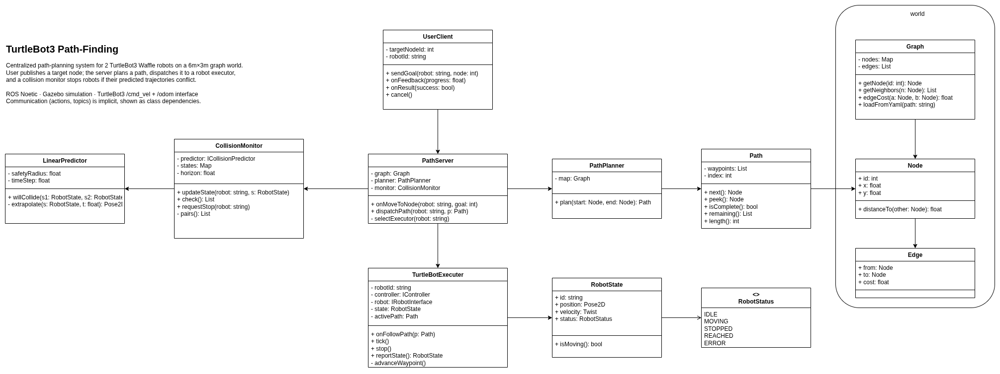

# IE251 Manufacturing Process — TurtleBot3 Path-Finding System

A centralized path-finding system for two TurtleBot3 Waffle robots navigating a shared graph on a 6 m × 3 m table. A user sends a target node ID to a central server; the server plans an A* path and dispatches it to the robot's executor, which drives between waypoints using a proportional controller. A collision monitor predicts head-on encounters and stops both robots before impact.

## Architecture
  

```
user_client (CLI)
      │  MoveToNode action
      ▼
  path_server ──── CollisionMonitor (10 Hz)
      │  FollowPath action        │ /tb3_0/emergency_stop
      ├──────────────────┐        │ /tb3_1/emergency_stop
      ▼                  ▼        ▼
tb3_0_executor     tb3_1_executor
  /tb3_0/cmd_vel    /tb3_1/cmd_vel
  /tb3_0/odom       /tb3_1/odom
      │                  │
      └──────────────────┘
              Gazebo
```

## Graph

Six nodes in a 3 × 2 grid. Seven edges (top row, bottom row, three verticals).

```
N1 ─── N3 ─────── N5      (top row,    y = 2.25 m)
│       │          │
N0 ─── N2 ─────── N4      (bottom row, y = 0.75 m)
```

| Node | x (m) | y (m) |
|------|--------|--------|
| 0    | 1.0    | 0.75   |
| 1    | 1.0    | 2.25   |
| 2    | 3.0    | 0.75   |
| 3    | 3.0    | 2.25   |
| 4    | 5.0    | 0.75   |
| 5    | 5.0    | 2.25   |

Spawn poses: `tb3_0` at node 0 (bottom-left), `tb3_1` at node 5 (top-right, facing left).

---

## Prerequisites

- Docker + Docker Compose
- An X server on the host (any Linux desktop, or XQuartz on macOS)

```bash
# Allow containers to open GUI windows (run once per host session)
xhost +local:docker
```

> **macOS:** Use XQuartz. Set `DISPLAY=host.docker.internal:0` and enable *Allow connections from network clients* in XQuartz preferences.

---

## Quick Start

### 1. Start the container

```bash
cd /path/to/ie251-manufacturing-process
sudo docker compose -f docker/docker-compose.yml up -d
sudo docker exec -it noetic zsh
```

### 2. Build (first time only)

```bash
echo "127.0.0.1 noetic" | sudo tee -a /etc/hosts
catkin_make --only-pkg-with-deps pathfinding_system
source devel/setup.zsh
```

### 3. Launch the full system

**Terminal 1** — Gazebo + robots + nodes:

```bash
source devel/setup.zsh
roslaunch pathfinding_system gazebo_world.launch
```

Gazebo opens. Two TurtleBot3 Waffles appear: one near the bottom-left, one near the top-right. Wait until both `/tb3_0/robot_state` and `/tb3_1/robot_state` topics are publishing before sending goals.

### 4. Send a goal

**Terminal 2:**

```bash
source devel/setup.zsh
rosrun pathfinding_system user_client tb3_0 5
```

`tb3_0` drives from node 0 to node 5 via the top route (0 → 1 → 3 → 5). The client prints feedback as each waypoint is reached and exits with code 0 on success.

---

## Usage

```
rosrun pathfinding_system user_client <robot_id> <target_node_id>
```

| Argument        | Values              |
|-----------------|---------------------|
| `robot_id`      | `tb3_0` or `tb3_1`  |
| `target_node_id`| `0` – `5`           |

### Example scenarios

**Single robot — corner to corner:**
```bash
rosrun pathfinding_system user_client tb3_0 5   # 0 → 1 → 3 → 5
```

**Two robots — parallel rows (no collision):**
```bash
# Terminal A                                # Terminal B
rosrun pathfinding_system user_client tb3_0 4   rosrun pathfinding_system user_client tb3_1 1
# tb3_0: bottom row 0 → 2 → 4              # tb3_1: top row 5 → 3 → 1
```

**Collision avoidance — head-on on N1–N3 edge:**
```bash
# Start both within ~1 s of each other
rosrun pathfinding_system user_client tb3_0 5   # top route: 0 → 1 → 3 → 5
rosrun pathfinding_system user_client tb3_1 0   # top route: 5 → 3 → 1 → 0
# CollisionMonitor fires; both robots stop before impact.
```

### Monitor state

```bash
rostopic echo /tb3_0/robot_state   # pose, velocity, status (0=IDLE 1=MOVING 2=STOPPED)
rostopic echo /tb3_0/emergency_stop  # fires when collision is predicted
```

---

## Configuration

**`config/graph.yaml`** — edit nodes and edges to change the layout.

**`config/params.yaml`** — key tuning values:

| Parameter | Default | Effect |
|-----------|---------|--------|
| `path_server.safety_radius` | 0.35 m | Stop if predicted distance drops below this |
| `path_server.horizon` | 2.0 s | How far ahead collision is predicted |
| `executor.controller.k_lin` | 0.5 | Linear speed gain |
| `executor.controller.k_ang` | 1.5 | Angular speed gain |
| `executor.controller.arrival_tol` | 0.10 m | Distance to declare a waypoint reached |

---

## Troubleshooting

**Gazebo window doesn't open**
```bash
xhost +local:docker
touch /tmp/.docker.xauth
xauth nlist $DISPLAY | sed -e 's/^..../ffff/' | xauth -f /tmp/.docker.xauth nmerge -
```

**`Failed to load model 'waffle'`**
```bash
export TURTLEBOT3_MODEL=waffle
roslaunch pathfinding_system gazebo_world.launch
```

**`rospack find pathfinding_system` fails**
```bash
source devel/setup.zsh
```

**Robot doesn't move after goal is sent**
Check that both executor nodes are alive and publishing robot state:
```bash
rostopic hz /tb3_0/robot_state
rostopic hz /tb3_1/robot_state
```

**Both robots stop and never resume**
An emergency stop is latched until a new `FollowPath` goal arrives. Send a new goal via `user_client` to resume.
