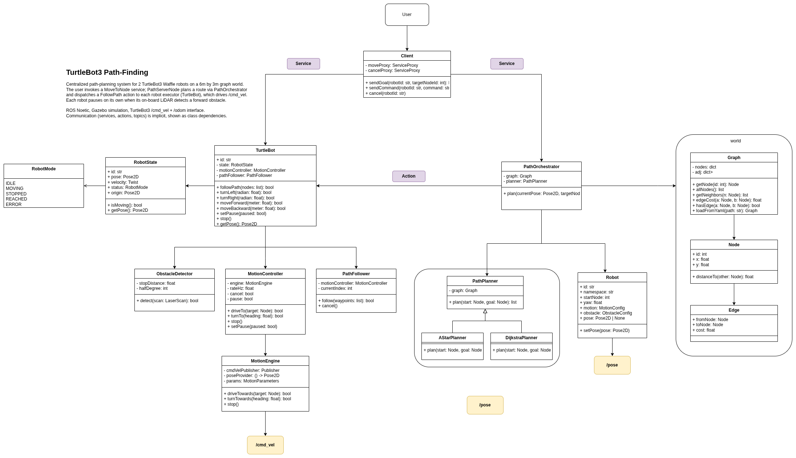
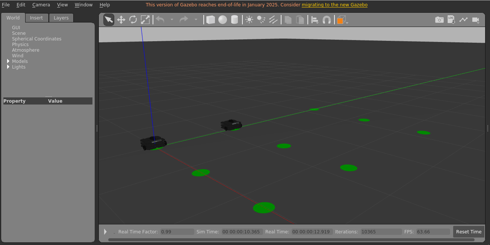

# TurtleBot3 Pathfinder

- [TurtleBot3 Pathfinder](#turtlebot3-pathfinder)
- [1. Architecture](#1-architecture)
- [2. Prerequisites](#2-prerequisites)
- [4. Quick Start](#4-quick-start)
  - [4.1. Simulation](#41-simulation)
  - [4.2. Real Robots](#42-real-robots)
- [5. Usage](#5-usage)
  - [6. Examples](#6-examples)
  - [Monitor state](#monitor-state)
- [7. Configuration](#7-configuration)
- [8. Troubleshooting](#8-troubleshooting)
- [8. Design Decisions](#8-design-decisions)


A centralized path-finding system for two TurtleBot3 Waffle robots navigating a shared graph on a 6 m × 3 m table. A user sends a target node ID to a central server; the server plans an A* path and dispatches it to the robot's executor, which drives between waypoints using a proportional controller. A collision monitor predicts head-on encounters and stops both robots before impact.

# 1. Architecture
  

```
client (CLI)
      │  MoveToNode action
      ▼
  path_server ──── CollisionMonitor (10 Hz)
      │  FollowPath action        │ /tb3_01/emergency_stop
      ├──────────────────┐        │ /tb3_05/emergency_stop
      ▼                  ▼        ▼
tb3_01_executor    tb3_05_executor
  /tb3_01/cmd_vel   /tb3_05/cmd_vel
  /tb3_01/odom      /tb3_05/odom
      │                  │
      └──────────────────┘
              Gazebo
```

# 2. Prerequisites

**Laptop (ROS master)**
- Docker + Docker Compose
- An X server on the host (any Linux desktop, or XQuartz on macOS)
- `avahi-daemon` running (ships and runs by default on Ubuntu desktop)

```bash
# Allow containers to open GUI windows (run once per host session)
xhost +local:docker
```

> **macOS:** Use XQuartz. Set `DISPLAY=host.docker.internal:0` and enable *Allow connections from network clients* in XQuartz preferences.

**Each TurtleBot3 (real robot only)**

```bash
sudo apt install avahi-daemon avahi-utils
sudo systemctl enable --now avahi-daemon
```

Verify the laptop is resolvable from the robot before starting any ROS nodes:

```bash
ping $(hostname).local   # run on the robot; should reach the laptop
```

---

# 4. Quick Start

## 4.1. Simulation
  

**Start the container**  
```bash
cd /path/to/ie251-manufacturing-process/docker
sed "s|your-laptop-hostname|$(hostname)|g" .env.example > .env
sudo docker compose up -d
sudo docker exec -it noetic zsh

# Build (first time only)
catkin_make
source devel/setup.zsh
```

**Launch simulation and pathfinding**

**Terminal 1** — Gazebo + simulated robots + pathfinding system:

```bash
source devel/setup.zsh
roslaunch pathfinder simulation.launch
```

Wait until the executor action servers are up and both odometry topics (`/tb3_01/sim/odom`, `/tb3_05/sim/odom`) are publishing before sending goals.


**Send a goal**

**Terminal 2**

```bash
source devel/setup.zsh
rosrun pathfinder client tb3_01 5
```

`tb3_01` drives from node 0 to node 5 via the top route (0 → 1 → 3 → 5). The client prints feedback as each waypoint is reached and exits with code 0 on success.

## 4.2. Real Robots

**Physical setup**

Place the two TurtleBot3 Waffles on the 6 m x 3 m table at their start nodes (defined in `config/robots.yaml`):

| Robot   | Node | x (m) | y (m) | Facing   |
|---------|------|--------|--------|----------|
| `tb3_01`| 4    | 0.0    | 1.3    | East (0 deg) |
| `tb3_05`| 5    | 1.2    | 1.3    | West (180 deg) |

Connect both robots and the laptop to the same LAN (e.g. the lab router). Note the laptop's IP address — it will act as the ROS master.

**Configure the ROS master address**

`docker-compose.yml` imports `docker/.env` into the container. The quick-start command below writes `ROS_HOSTNAME=$(hostname).local`; `ROS_MASTER_URI` is derived from `ROS_HOSTNAME` in `.env`. No manual edits are needed as long as `avahi-daemon` is running. Leave `ROS_IP` empty when using `ROS_HOSTNAME`.

**Start the laptop container**

```bash
cd /path/to/ie251-manufacturing-process/docker
sed "s|your-laptop-hostname|$(hostname)|g" .env.example > .env
sudo docker compose up -d
sudo docker exec -it noetic zsh

# Build (first time only)
catkin_make
source devel/setup.zsh
```

**Bring up each TurtleBot3**

SSH into each robot's Raspberry Pi and set it to use the laptop as the ROS master, then launch the bringup with the correct namespace.

**On `tb3_01` (the robot placed at node 0):**

```bash
export ROS_MASTER_URI=http://$(laptop-hostname).local:11311
export ROS_HOSTNAME=$(hostname).local
export ROS_NAMESPACE=tb3_01
roslaunch turtlebot3_bringup turtlebot3_robot.launch
```

**On `tb3_05` (the robot placed at node 5):**

```bash
export ROS_MASTER_URI=http://$(laptop-hostname).local:11311
export ROS_HOSTNAME=$(hostname).local
export ROS_NAMESPACE=tb3_05
roslaunch turtlebot3_bringup turtlebot3_robot.launch
```

Replace `$(laptop-hostname)` with the actual output of `hostname` on the laptop (e.g. `mypc`). Each robot's `ROS_HOSTNAME` is set to its own mDNS name so the master can route topic traffic back to it.

Each bringup publishes `/<namespace>/odom` and subscribes to `/<namespace>/cmd_vel`, which is what the executor expects.

**Launch the pathfinding system**

Back in the laptop container (**Terminal 1**):

```bash
source devel/setup.zsh
roslaunch pathfinder robots.launch
```

Confirm the executors are ready by checking that odometry is arriving:

```bash
rostopic hz /tb3_01/odom
rostopic hz /tb3_05/odom
```

Both should report ~30 Hz before you send any goals.

**Send a goal**

**Terminal 2** (inside the same container):

```bash
source devel/setup.zsh
rosrun pathfinder client tb3_01 5   # drives node 0 → 1 → 3 → 5
```

The client prints feedback at each waypoint and exits with code 0 on success.

---

# 5. Usage

```
rosrun pathfinder client <robot_id> <target_node_id>
```

| Argument        | Values              |
|-----------------|---------------------|
| `robot_id`      | `tb3_01` or `tb3_05`  |
| `target_node_id`| `0` – `5`           |

## 6. Examples

**Single robot — corner to corner:**
```bash
rosrun pathfinder client tb3_01 5   # 0 → 1 → 3 → 5
```

**Two robots — parallel rows (no collision):**
```bash
# Terminal A                                # Terminal B
rosrun pathfinder client tb3_01 4   rosrun pathfinder client tb3_05 1
# tb3_01: bottom row 0 → 2 → 4             # tb3_05: top row 5 → 3 → 1
```

**Collision avoidance — head-on on N1–N3 edge:**
```bash
# Start both within ~1 s of each other
rosrun pathfinder client tb3_01 5   # top route: 0 → 1 → 3 → 5
rosrun pathfinder client tb3_05 0   # top route: 5 → 3 → 1 → 0
# CollisionMonitor fires; both robots stop before impact.
```

## Monitor state

```bash
rostopic echo /tb3_01/sim/odom        # pose and velocity from Gazebo
rostopic echo /tb3_01/emergency_stop  # fires when collision is predicted
```

---

# 7. Configuration

**`config/graph.yaml`** — edit nodes and edges to change the layout.

**`config/robots.yaml`** — edit robot IDs when adding or renaming robots.

**`config/params.yaml`** — key tuning values:

| Parameter | Default | Effect |
|-----------|---------|--------|
| `path_server.safety_radius` | 0.35 m | Stop if predicted distance drops below this |
| `path_server.horizon` | 2.0 s | How far ahead collision is predicted |
| `executor.controller.k_lin` | 0.5 | Linear speed gain |
| `executor.controller.k_ang` | 1.5 | Angular speed gain |
| `executor.controller.arrival_tol` | 0.10 m | Distance to declare a waypoint reached |

---

# 8. Troubleshooting

**Gazebo window doesn't open**
```bash
xhost +local:docker
touch /tmp/.docker.xauth
xauth nlist $DISPLAY | sed -e 's/^..../ffff/' | xauth -f /tmp/.docker.xauth nmerge -
```

**`Failed to load model 'waffle'`**
```bash
export TURTLEBOT3_MODEL=waffle
roslaunch pathfinder simulation.launch
```

**`rospack find pathfinder` fails**
```bash
source devel/setup.zsh
```

**Robot doesn't move after goal is sent**
Check that both executor nodes are alive and odometry is available:
```bash
rostopic hz /tb3_01/sim/odom
rostopic hz /tb3_05/sim/odom
```

**Both robots stop and never resume**
An emergency stop is latched until a new `FollowPath` goal arrives. Send a new goal via `client` to resume.

---

# 8. Design Decisions

**`*Node` classes are the assembly layer and are not unit-tested.** `TurtleBotNode`, `PathServerNode`, and similar classes are responsible for instantiating components, wiring them together, and creating all ROS publishers/subscribers. All topic names live here. They are covered by integration tests only. Every other class follows constructor injection and must be unit-testable without a running ROS core.
