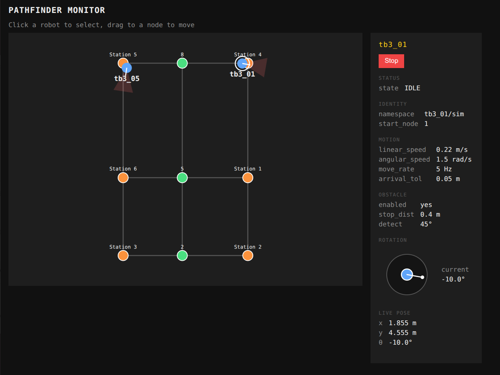

# TurtleBot3 Pathfinder

Centralized graph navigation for two TurtleBot3 Waffle robots on a 6 m x 3 m table. A fleet service plans A* paths over `graph.yaml`, dispatches per-robot `FollowPath` goals, and exposes ROS services used by the CLI and web dashboard.

## Architecture
  

```text
CLI / Web UI
    |
    | /fleet/move_to_node, /fleet/cancel_path, /fleet/rotate_robot
    v
path_server
    |
    | FollowPath action goals
    v
robot_executors
    |
    | /<robot>/cmd_vel, /<robot>/odom, /<robot>/path_status
    v
Gazebo or real TurtleBot3s
```

Key pieces:
- `path_server`: loads graph + robot config, owns fleet services, plans paths.
- `robot_executors`: one executor per robot; follows paths, handles stop/rotate commands, and applies obstacle settings.
- `web-ui`: rosbridge dashboard for live poses, drag-to-node dispatch, stop, and rotation.

## Prerequisites

- Docker + Docker Compose
- ROS Noetic environment from `docker/`
- X server for Gazebo/RViz windows
- Real robots only: TurtleBot3 bringup installed and all machines on the same LAN

Allow GUI windows from Docker once per host session:

```bash
xhost +local:docker
```

## Quick Start
Use one runtime mode at a time: simulation.launch for Gazebo, or robots.launch for physical robots. 
  > Do not run both against the same ROS master.

### Setup

```bash
cd docker
cp .env.example .env
# Set ROS_HOSTNAME to your laptop hostname.local or IP.

sudo docker compose up -d
sudo docker exec -it noetic zsh

catkin_make
source devel/setup.zsh
```

For real robots, use mDNS or fixed IPs consistently. Each robot should reach the laptop ROS master before launching bringup.

### Simulation
  

```bash
source devel/setup.zsh
roslaunch pathfinder simulation.launch
```
This will start Gazebo and virtual robots based on robots.yaml

### Real Robots

Place robots at their configured start stations

On each TurtleBot3:

```bash
export ROS_MASTER_URI=http://<laptop-hostname>.local:11311
export ROS_HOSTNAME=$(hostname).local
export ROS_NAMESPACE=<tb3_01-or-tb3_05>
roslaunch turtlebot3_bringup turtlebot3_robot.launch
```

In the laptop container, auto-detect connected robots and launch the stack:

```bash
source devel/setup.zsh
roslaunch pathfinder robots.launch
```

### Web UI
  

The ROS launch files start rosbridge on port `9090` by default.

```bash
cd web-ui
cp .env.example .env
docker compose up
```

Open `http://localhost:5173`.

The dashboard shows the graph, station nodes, robot poses, path state, robot config, stop control, and rotation control. Click a robot to select it, then drag it to a graph node to dispatch a move.

### CLI

```bash
rosrun pathfinder client <robot_id> <target_node_id>
rosrun pathfinder client <robot_id> stop
rosrun pathfinder client <robot_id> turn_left 90
rosrun pathfinder client <robot_id> move_forward 0.2
```

Robot IDs come from `config/robots.yaml`. Target node IDs come from `config/graph.yaml`.


## Configuration

- `src/pathfinder/config/graph.yaml`: graph nodes, edges, station numbers, and optional station orientations.
- `src/pathfinder/config/robots.yaml`: robot IDs, `start_station`, motion tuning, and obstacle tuning.

Robots can only start at station nodes. `start_station` must match a station number in `graph.yaml`.

## Troubleshooting

Gazebo or RViz does not open:

```bash
xhost +local:docker
```

ROS package is not found:

```bash
source devel/setup.zsh
```

Robot does not move:

```bash
rostopic hz /<robot_id>/odom
rosservice call /fleet/get_robots
```

Web UI cannot connect:

```bash
rosnode list | grep rosbridge
echo $VITE_ROSBRIDGE_URL
```
